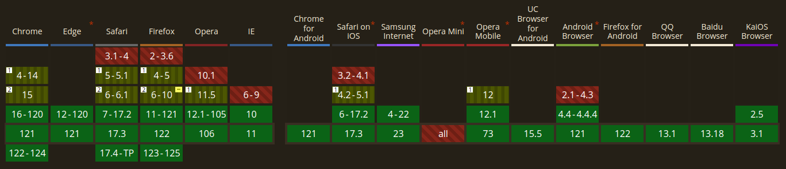

# Web Socket

this is an advanced technology that makes it possible to open a two-way interactive communication session between the user's browser and a server.
in other words :web socket is a way to exchange data between browser and server via a persistent connection.
you remember `fetch` and `XMLHttpRequest` aren't **open** and **two-way**!
in this way browser request data from a server.
but with the `webSocket` you can send messages to a server and receive event-driven responses without having to poll the server for a reply.

## Use Cases

online games, real-time trading systems ,Live chat,Realtime location tracking,Data synchronization , E-Learning Applications and etc.
and everywhere you need a Real-time application or bidirectional!

## What we have?

- `WebSocket` :this interface used for connecting to a WebSocket server and then sending and receiving data on the connection.
- `MessageEvent` :The event sent by the WebSocket object when a message is received from the server.
- `CloseEvent` :The event sent by the WebSocket object when the connection closes.

## But How we can Use Web Socket ?

so we must first open a connection

```js
const socket = new WebSocket('ws://the url of connection')

// consider this special protocol ws must be in the url

const socket = new WebSocket('wss://the url of connection')
// we have this one alo its encrypted and more reliable protocol (like HTTPS)
```

when we opened the connection we can listen to the four events :

- open – connection established.
- error – websocket error.
- message – data received.
- close – connection closed.

example :

```js
const socket = new WebSocket(
  'wss://javascript.info/article/websocket/demo/hello'
)

//client send the data
socket.onopen = (e) => {
  alert('[open] Connection established')
  alert('Sending to server')
  socket.send('My name is John')
}

// server send the data
socket.onmessage = (event) => {
  alert(`[message] Data received from server: ${event.data}`)
}

socket.onclose = (event) => {
  if (event.wasClean) {
    alert(
      `[close] Connection closed cleanly, code=${event.code} reason=${event.reason}`
    )
  } else {
    // e.g. server process killed or network down
    // event.code is usually 1006 in this case
    alert('[close] Connection died')
  }
}

socket.onerror = (error) => {
  alert(`[error]`)
}
```

the server close the connection after 5 seconds

```js
const http = require('http')
const ws = require('ws')

const wss = new ws.Server({ noServer: true })

function accept(req, res) {
  // all incoming requests must be websockets
  if (
    !req.headers.upgrade ||
    req.headers.upgrade.toLowerCase() != 'websocket'
  ) {
    res.end()
    return
  }

  // can be Connection: keep-alive, Upgrade
  if (!req.headers.connection.match(/\bupgrade\b/i)) {
    res.end()
    return
  }

  wss.handleUpgrade(req, req.socket, Buffer.alloc(0), onConnect)
}

function onConnect(ws) {
  ws.on('message', function (message) {
    message = message.toString()
    let name =
      message.match(/([\p{Alpha}\p{M}\p{Nd}\p{Pc}\p{Join_C}]+)$/gu) || 'Guest'
    ws.send(`Hello from server, ${name}!`)

    setTimeout(() => ws.close(1000, 'Bye!'), 5000)
  })
}

if (!module.parent) {
  http.createServer(accept).listen(8080)
} else {
  exports.accept = accept
}
```

## Advantages of Web Socket

1. with WebSocket we can provide a real-time updates and open lines of communication.
2. There are many open-source resources for incorporating WebSockets in an application, example : Socket.io and etc .
3. WebSockets can stream through many proxies and firewalls.
4. web Socket are cross platform and not just web and js ! WebSockets are compatible across Android, iOS, and desktop platforms.
5. all modern web browsers—Google Chrome, Mozilla Firefox, Apple Safari, and more support Web socket
6. its scalable !A single server can have multiple WebSocket connections open simultaneously and multiple connections with the same client!

## Disadvantages of Web Socket

1. Browser Support: most modern browsers support WebSockets but some older ones do not. This can limit the reach of your application and require additional fallback mechanisms for older browsers.
2. Features like Presence do not work well over WebSocket connections because disconnections are hard to detect.
3. It is still necessary to have fallback options, like HTTP streaming or long polling, in environments where Web Sockets may not be supported.
4. If a connection over Web Sockets is lost, there are no included load balancing or reconnecting mechanisms.
5. Stateful Nature: Unlike traditional HTTP, which is stateless, WebSockets are stateful. This means that the server needs to maintain the connection state for each client, leading to increased memory usage and potential scalability challenges.

## Web socket Libraries

1. Socket.IO : 59k stars on `GitHub` and about 3 million weekly `npm` downloads ,offers features like : automatic reconnection, fallback options, and support for various transports and supports multiple programming languages, including JavaScript, Python, and Java.
2. WS : simple and lightweight library for Node js .features : per-message compression, automatic reconnection, and customizable options for handling incoming and outgoing messages.
3. SockJs
4. SignalR : developed by Microsoft / supports server-side and client-side implementations and can be used with .NET, JavaScript, and other languages. also features like automatic connection management, broadcasting messages, and scaling across multiple servers.
5. µWebSockets : written in C++ / designed to be lightweight and efficient / high-performance and low latency
6. Faye-WebSocket
7. Primus
8. SocketCluster
9. caddy
10. Cowboy : a small, fast and modern HTTP server for Erlang/OTP with WebSocket support.

## Can I Use ?

freely use it because :
`98.41% + 0.02%=98.43%`



## Summary

WebSockets are a very useful protocol for building real-time functionality across web, mobile, and desktop variants, but they are not a one-size-fits-all approach.when you developing real-time, communication-based applications that require low latency you must use web socket.we explored some library and you can use them for better developing experience and some features.
